Thanks for the clarification! I’ll examine the BMAD-METHOD GitHub repository to:

* Create Mermaid diagrams for a Greenfield and Brownfield project, showing standard agent lifecycle and how different agent capabilities (e.g., /dev, /qa) are involved at various stages.
* Include command patterns that agents can execute at each step.
* Build individual flowcharts for each agent under the `bmad-code` folder, focusing on user-agent interaction flows.

I’ll get started and update you once I have the results ready.

# BMAD Agent Workflow Diagrams

BMAD-METHOD (Breakthrough Method of Agile AI-Driven Development) introduces specialized AI agents that collaborate in an Agile workflow. Below are diagrams and explanations illustrating how to work with these agents for different project scenarios and roles. Each diagram is presented in Mermaid flowchart format with example commands, and all interactions between the user and agents are shown.

## Greenfield Project Workflow (New Project)

For a new **Greenfield** project, the BMAD agents follow a structured Agile process covering **analysis**, **requirements**, **design**, **development**, and **testing**. The flowchart below shows the main stages, the responsible agent at each stage, and example commands to invoke those agents:

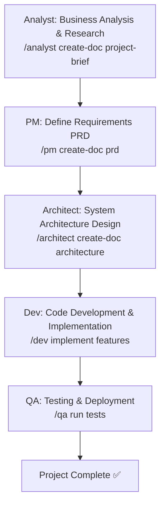

In this Greenfield workflow, the **Analyst** agent conducts market research and gathers requirements (often by creating a Project Brief). Next, the **Product Manager (PM)** agent produces a Product Requirements Document (PRD) defining features and priorities. The **Architect** agent then designs the system architecture. Once planning is done, the **Developer (Dev)** agent implements the features in code. Finally, the **QA Specialist** agent handles test planning and quality assurance, ensuring the developed product passes all tests before deployment. Each arrow above represents the transition to a new phase where the user invokes the next agent with a slash command (e.g. `/pm create-doc prd` to have the PM create a PRD).

*(Greenfield steps reference: 1. Business analysis, 2. Requirements definition, 3. Architecture design, 4. Development, 5. Testing.)*

## Brownfield Project Workflow (Existing Project)

For an existing **Brownfield** project (enhancing or adding features to an established system), the workflow is slightly adapted. It emphasizes understanding the current system and planning incremental changes. The flowchart below outlines a Brownfield process with example agent commands:

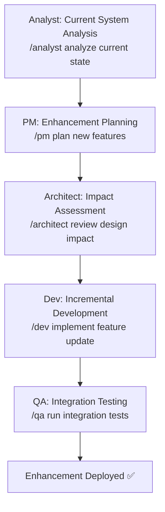

In this Brownfield scenario, the **Analyst** (or another suitable role) first examines the existing system and requirements (e.g. reviewing documentation or user feedback). Then the **PM** agent plans the enhancement – updating the PRD or writing a mini-requirements doc for the new feature. The **Architect** evaluates the impact of the changes on the current architecture (ensuring compatibility and noting any refactoring needs). Next, the **Dev** agent implements the new feature in an incremental, non-disruptive way. Finally, the **QA** agent performs integration testing to confirm the new feature works with the existing system without regressions. Just like in Greenfield, each stage is triggered by the user engaging the respective agent (for example, the user might type `/architect create-doc architecture` to update design documentation for the enhancement, or `/qa run tests` to execute the test suite). This ensures a smooth Agile cycle even in legacy projects.

*(Brownfield steps reference: 1. Current system analysis, 2. Enhancement planning, 3. Impact assessment, 4. Incremental dev, 5. Integration testing.)*

## Development & QA Lifecycle (Dev–QA Handoff)

A critical part of the Agile workflow is the iteration between development and testing. The diagram below captures a standard **Dev–QA lifecycle** during implementation, showing how the Developer and QA agents collaborate with the user to ensure quality:

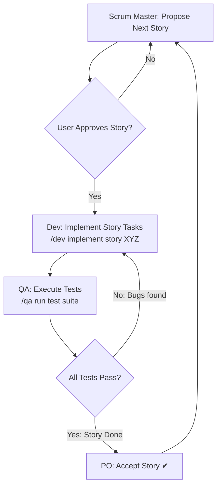

In this lifecycle, the **Scrum Master (SM)** agent (or the user) selects a user story for development from the backlog. The user (often playing the Product Owner role) reviews and approves the story before implementation. Once approved, the **Dev** agent writes code to implement the story's tasks (e.g. the user issues a command like `/dev implement story 1.2` to start development on story 1.2). When development is complete, the **QA** agent is invoked to run tests on the new code (such as executing unit tests, integration tests, etc.). If the QA tests uncover bugs or failed criteria, the workflow loops back – the Dev agent addresses the issues and the QA agent re-tests the fixes. Once all tests pass, the **Product Owner (PO)** (or user acting as PO) verifies the story against acceptance criteria and marks it as done. This iterative loop continues until the story is completed to satisfaction, ensuring high quality through Dev–QA collaboration.

*(The Dev–QA cycle aligns with BMAD’s Quality Assurance phase where QA does testing and the Dev fixes any bugs.)*

## Common Agent Command Patterns

BMAD agents are invoked via special command patterns. The commands can differ slightly between an IDE integration and a Web UI chat interface, but the idea is consistent: you prefix your request with the agent’s name. Below are the common patterns and examples of tasks:

* **IDE Commands (`@agent-name`)** – In supported IDEs like Cursor or Windsurf, you trigger an agent by typing `@<agent> <task>`. For example: `@pm Create a PRD for user management` or `@dev Fix the login bug`. In Claude’s coding environment, the pattern is `/agent-name task` (same idea but using a slash).
* **Web UI Commands (`/agent-name`)** – In a chat interface (ChatGPT, Claude, etc.), you use a slash. For example: `/pm create-doc prd` to have the Product Manager agent create a PRD, `/architect Design microservices architecture`, or `/dev implement story 1.2`. The agent responds in its specialized role.
* **Universal Commands** – Some commands work for any agent (especially via an orchestrator or team bundle) to get meta-information: `/help` (list available commands), `/status` (show current agent status), or `/switch agent-name` (swap the active agent role).
* **Document Creation and Review** – Many agents support document-centric commands. The generic form `/create-doc <type>` tells an agent to generate a certain document (e.g. PRD, architecture) based on its templates. Similarly, `/review-doc` asks the agent to review the current document, and `/refine-doc` to improve it.
* **Planning and Checklist Commands** – During project planning, specialized commands help enforce completeness. For instance, `/analyst create-doc project-brief` creates a Project Brief, `/pm create-doc prd` creates a PRD, `/architect create-doc architecture` generates a design doc, and `/po run-checklist` runs a Product Owner’s checklist to verify all documents and stories align. These commands leverage built-in templates and checklists for consistency.

Using these patterns, you interact naturally with each agent. You can always ask an agent for its capabilities by using the help command (e.g. typing `*help` in IDE or `/help` in chat) to see what that agent can do.

## Agent-Specific Interaction Flows

Next, we provide a flowchart for each BMAD agent, illustrating how a user would typically interact with that agent and what the agent produces. Each agent has a distinct role and **capabilities** in the Agile team, and the flows below show example interactions in context.

### Analyst (Business Analyst) Agent

The **Analyst** agent specializes in early-stage planning: market research, brainstorming, and requirements gathering. A common interaction with the Analyst is to create a **Project Brief** or conduct a feasibility analysis for a new idea.

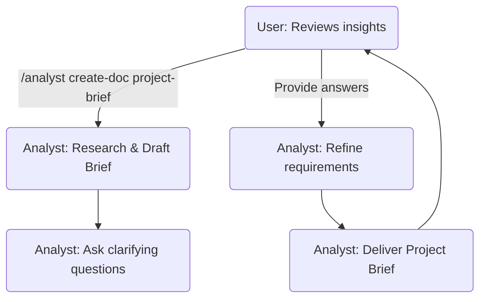

In this flow, the **User** invokes the Analyst (for example with `/analyst create-doc project-brief`) to perform market research and draft a project brief. The Analyst agent may ask follow-up questions to clarify project context or requirements, then iteratively refines the brief. Finally, the Analyst produces a document or summary of findings (market analysis, key requirements, etc.) and shares it with the user. The user can then review these insights to inform the next steps. This agent is best used at the **project initiation** stage for brainstorming and defining the problem space.

### Product Manager (PM) Agent

The **Product Manager** agent is responsible for defining the product vision, requirements, and priorities. A typical use case is generating a **Product Requirements Document (PRD)** and managing the feature roadmap.

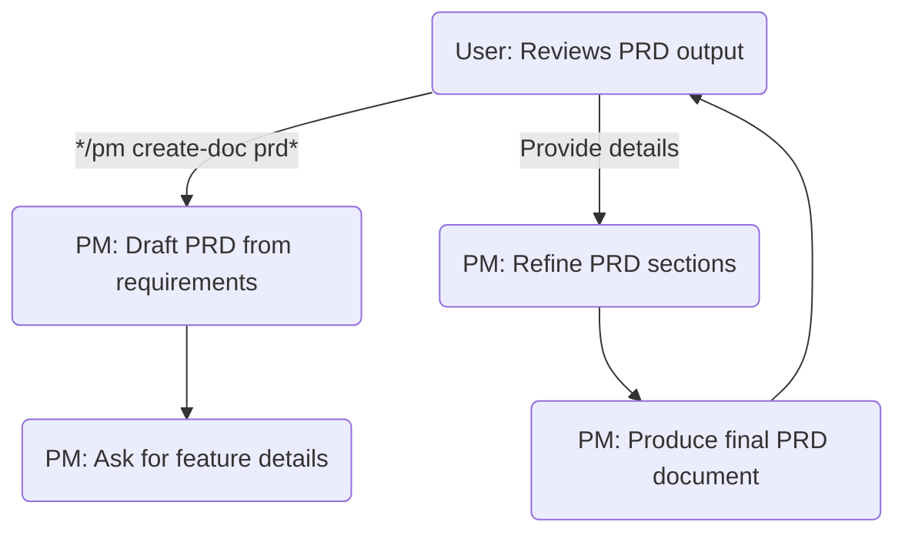

Here the user triggers the PM agent to create a PRD (e.g. `/pm create-doc prd`). The PM agent gathers existing requirements (from the Analyst’s brief or user input) and drafts the PRD, possibly prompting the user for additional feature details or priorities. The agent then refines each section (such as objectives, user stories, acceptance criteria) through an interactive process. The result is a comprehensive PRD document which the PM agent delivers. The user reviews this PRD to ensure it meets the vision and can then proceed to architecture and development. The PM agent is typically used in **planning and definition** phases to solidify *what* needs to be built.

### Solution Architect Agent

The **Architect** agent focuses on technical design and system architecture. After the PRD is ready, the user engages the Architect to produce an **Architecture Document** (system design).

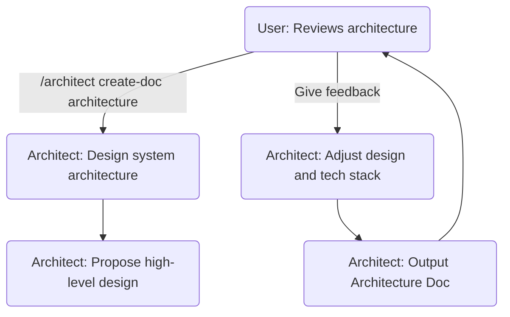

In this interaction, the user calls on the Architect agent with a command like `/architect create-doc architecture`. The Architect then drafts the system design based on the PRD – this can include architecture diagrams, component descriptions, technology stack decisions, etc.. The agent might present an initial high-level design and ask for user feedback or preferences (for example, clarifying non-functional requirements or specific technologies). The user’s input is incorporated as the Architect refines the design. Finally, the Architect outputs a complete Architecture Document. The user reviews it to ensure it aligns with the requirements and constraints. The Architect agent is used in the **design phase** to determine *how* the system will be built.

### Developer (Dev) Agent

The **Developer** agent handles implementation – writing code, debugging, and solving development tasks. Developers are invoked throughout the development phase for each user story or feature.

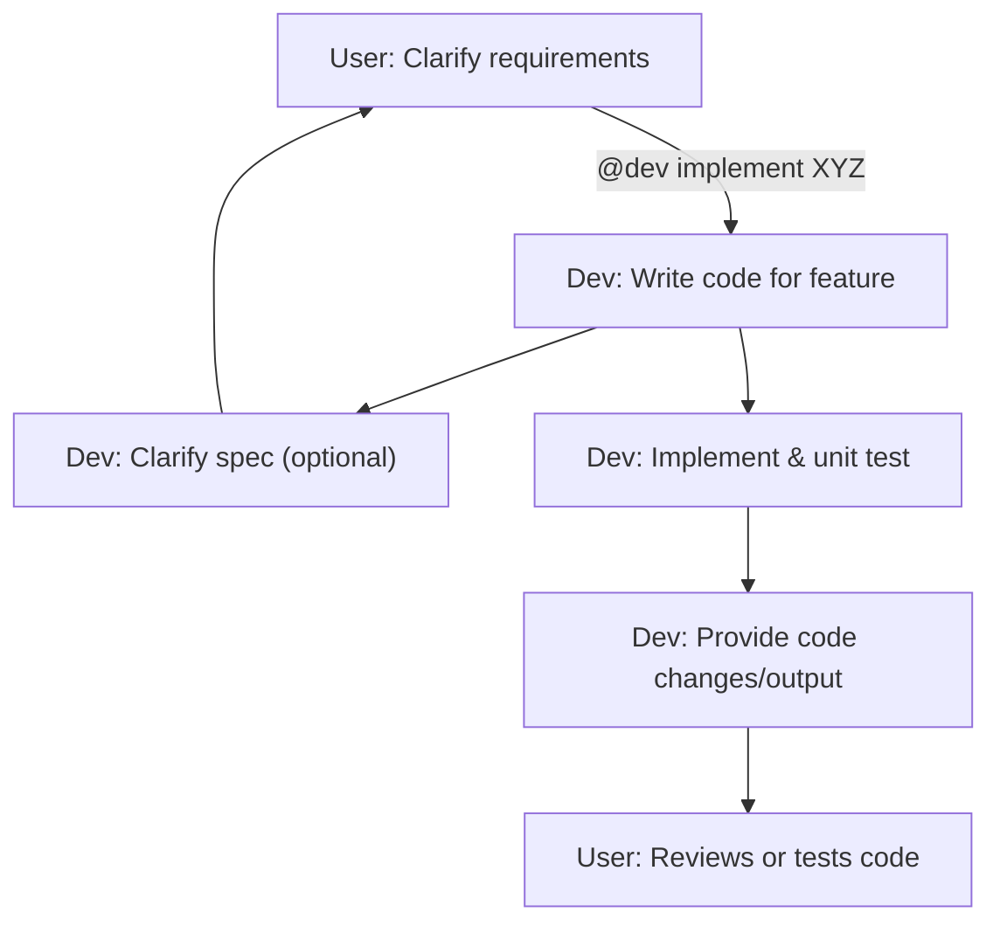

In this flow, the user (or Scrum Master on behalf of the team) assigns a development task to the Dev agent, for example via `@dev implement login feature` in an IDE or `/dev implement story 5.1` in chat. The Dev agent proceeds to write code for the feature. It may ask clarifying questions if any requirements are unclear. The user provides answers or additional context (e.g. acceptance criteria or edge cases). The Dev agent then writes the code, possibly even running basic unit tests internally if it has that capability, and presents the code output or a summary of changes. The user (or QA) then reviews or runs the code. This **development iteration** is repeated for each story. The Developer agent is central during the **implementation phase**, and it can handle any programming tasks, bug fixes, or code generation across technologies.

### QA Specialist (QA) Agent

The **QA** agent is responsible for testing, quality assurance, and ensuring that the software meets acceptance criteria. Users interact with the QA agent to create test plans or run tests on the developed features.

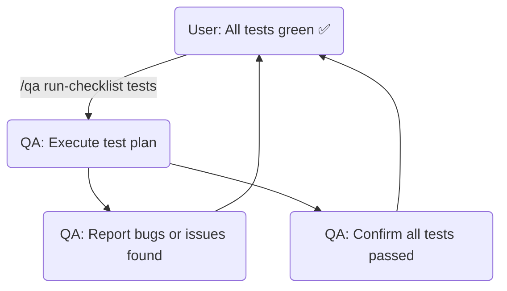

In the QA flow, the user invokes the QA agent to run tests (for example, the user might run a checklist or a test suite via a command like `/qa run tests` or similar). The QA agent executes the test plan or test automation and then reports results. If bugs or issues are found, the QA agent outputs a detailed bug report or list of failed cases – the user (and the Dev agent) will use this to fix the problems. If all tests pass, the QA agent confirms that the build is clean. In practice, this agent can also be used to generate test cases or suggest testing strategies. It plays a key role in the **quality assurance phase**, catching issues early and ensuring that each story meets the definition of done. (Often the QA agent works in tandem with the Dev agent: see the Dev–QA lifecycle above for how they iterate.)

### UX-Expert (UX Designer) Agent

The **UX-Expert** agent (User Experience Designer) helps design the user interface and user experience aspects of the project. The user engages this agent for UI/UX planning, wireframing (in text form), or usability advice.

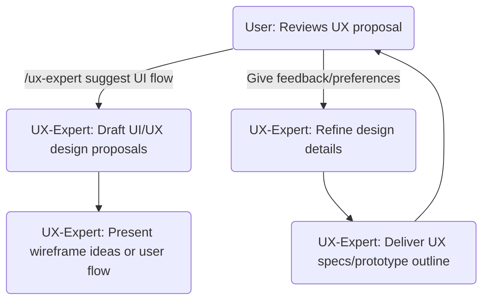

In this interaction, the user might ask the UX agent for a design on a feature (e.g., "/ux-expert create a wireframe for the signup page"). The UX-Expert agent responds by drafting a user flow or describing a wireframe/prototype for the interface. It could list UI components, layout ideas, or even produce a simple ASCII or Mermaid diagram for the UI if templates allow. The agent may ask the user for branding guidelines or user preferences to tailor the design. The user provides feedback (such as preferred color schemes or layouts), and the UX agent refines the design. Finally, the UX-Expert delivers a UX specification or prototype outline. The user reviews this to ensure it aligns with the product vision. This agent is utilized during the **design phase** in parallel with architecture, focusing on the *user interface and experience* aspect of the product.

### Product Owner (PO) Agent

The **Product Owner** agent oversees the backlog, user stories, and acceptance criteria. In BMAD, the PO agent often helps break down high-level requirements into epics and stories and ensures everything aligns with the PRD.

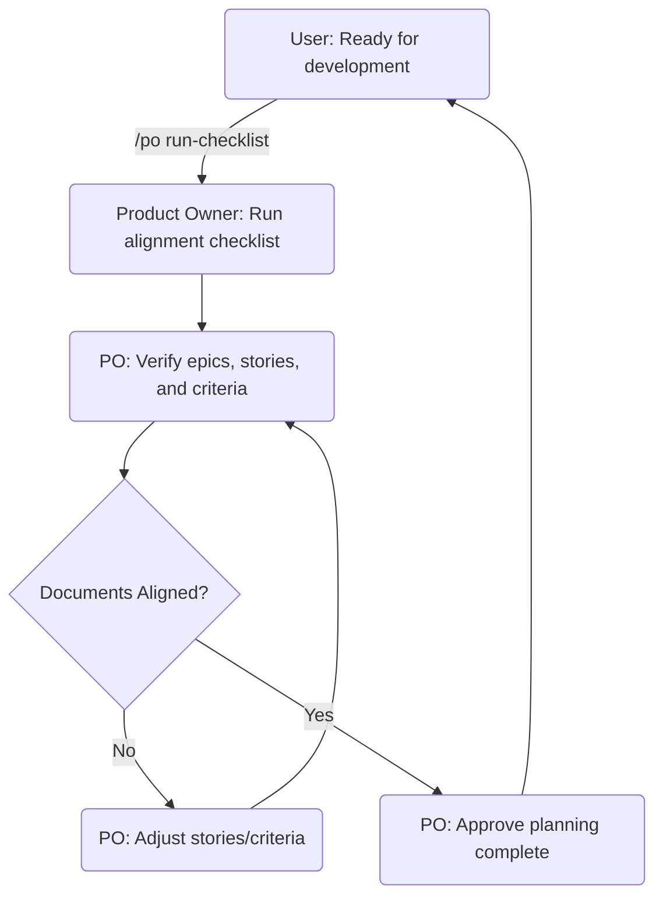

In this flow, the user triggers the PO agent to perform a "master checklist" – for example, `/po run-checklist` will cause the PO to validate that the PRD, architecture, and backlog are consistent and complete. The PO agent goes through each epic and story, checking that every requirement from the PRD is accounted for and that acceptance criteria are clear. If the checklist finds gaps or misalignments (e.g., a feature with no user story, or an epic missing in the PRD), the PO agent will highlight them. The user (or PO agent) then updates the stories or criteria accordingly, and the checklist is run again until everything is aligned. Once the documents and plans are aligned, the PO agent effectively approves that planning is complete and the team can move into active development. The PO agent is mainly used at the **intersection of planning and execution**, to ensure the backlog truly reflects the product requirements and to sign off that the team can start development.

### Scrum Master (SM) Agent

The **Scrum Master** agent facilitates Agile processes: sprint planning, story creation, and keeping the team on track. A common task for the SM agent is to take high-level requirements (epics) and **draft user stories** or plan sprints.

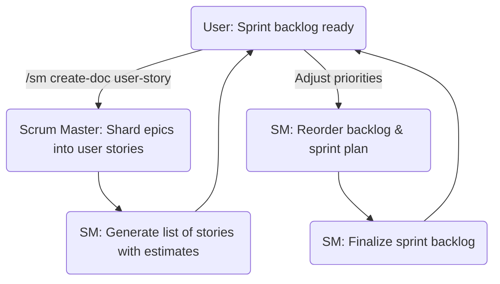

In this scenario, the user asks the SM agent to create user stories (e.g. `/sm create-doc user-story` to generate a User Story document or backlog from the epics). The Scrum Master agent takes the input (perhaps the PRD or an epic description) and shards it into a set of detailed user stories with story points or time estimates. It presents the list of stories to the user/team. The user can then review these, maybe adjusting priority or scope. The SM agent will update the backlog ordering or even group stories into sprints based on the input. Finally, the SM provides a finalized sprint backlog or sprint plan. The Scrum Master agent is used during **sprint planning and backlog grooming**, converting plans into actionable work for the Dev team. It ensures the team always knows “what’s next” in development.

### BMad Orchestrator (Team Coordinator) Agent

The **BMAD Orchestrator** is a special meta-agent that coordinates all other agents and workflows. It can dynamically assume any role or guide the user through multi-agent processes. Think of it as the **team coordinator** that helps choose which agent or workflow is needed at a given time.

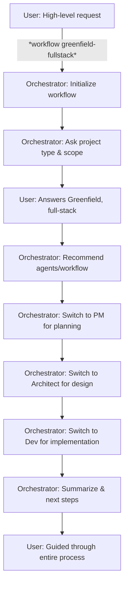

In this flow, the user issues a broad instruction to the orchestrator (for example, `*workflow greenfield-fullstack` in the IDE or a general request like "Start a new project" in chat). The Orchestrator agent responds by gathering basic info (project type, scope) and then sets up the workflow. It will **recommend the next steps or automatically switch to the relevant agent** for each stage. For instance, it may announce "Now switching to Product Manager for requirements" and effectively become the PM agent to create the PRD, then later become the Architect agent for design, and so on. The orchestrator handles these transformations internally, so the user doesn’t have to manually switch agents each time – it guides the user through an entire multi-agent workflow. Throughout, the orchestrator keeps track of the overall state and ensures each role is invoked in order. By the end, the user is taken through planning, design, development, etc., with the orchestrator summarizing progress and suggesting next steps. The Orchestrator is especially useful for **complex, multi-step tasks** or when you're not sure which agent to use; it will pick the right specialist (or instruct you how to proceed) at each juncture. It also supports commands like `*agent <name>` to directly switch to a specific agent, `*task <name>` to run predefined tasks, and `*help` to list available options.

### BMad Master (Universal Expert) Agent

The **BMAD Master** agent is another meta-agent that possesses **all capabilities in one**. Unlike the orchestrator, the Master agent doesn’t switch personas; it acts as a single universal expert that can handle any request across the entire development lifecycle.

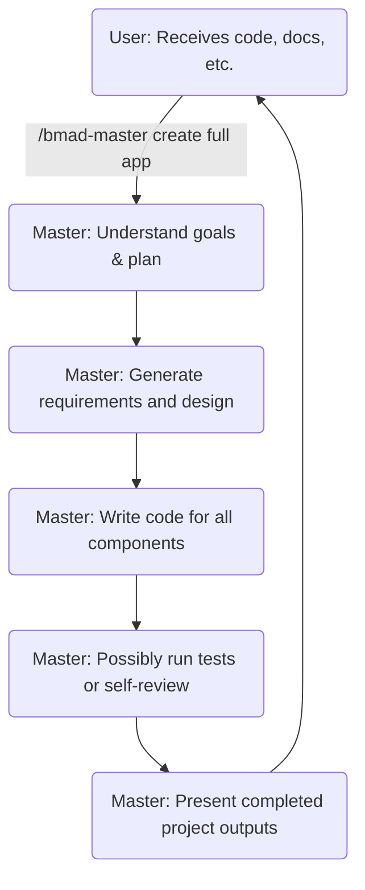

In this flow, the user gives a high-level instruction to the BMad Master agent (for example, asking it to create an entire application or solve an end-to-end problem). The Master agent parses the request and formulates a plan. It can produce its own requirements or break down tasks internally, then proceed to generate the necessary artifacts. For instance, it might draft a mini-PRD or outline, then directly start coding the solution (covering front-end, back-end, etc. as needed). It may even execute tests or review its output for consistency (since it has QA and dev knowledge combined). Finally, the BMad Master provides the user with all the outputs – code files, documentation, and any other relevant results – in one go or in an interactive manner. The user receives a comprehensive result without manually coordinating between agents. The Master agent is ideal for **one-shot or single-session tasks** where you want a single AI agent to handle everything together. It trades the fine-grained 
control of individual agents for convenience, as it encapsulates the entire Agile team’s knowledge in one persona.

Great — I’ll now create two additional Mermaid diagrams:

1. A feature delivery flowchart starting after PRD and architecture are completed, showing the sequential tasks handled by Architect → PO → SM → Dev → QA.
2. A sprint planning and execution flowchart showing the broader cycle of backlog grooming, planning, delivery, and review across those same agents.

I’ll also write out step-by-step instructions for each agent in both workflows using standard BMAD commands.

I’ll update the canvas with these new diagrams and instructions shortly.

## Feature Delivery Flowchart (Post-PRD and Architecture)

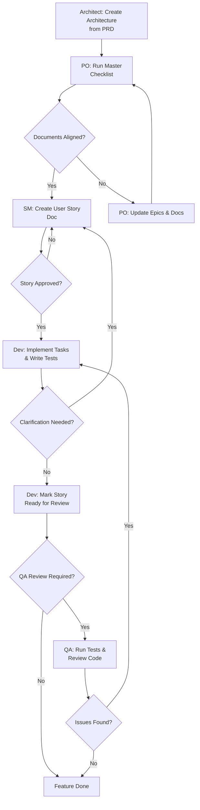

**Step-by-Step Guide:**

1. **Architect** – Designs the technical solution and produces the Architecture document based on the PRD. This is done by the Architect agent using the `/architect create-doc architecture` command to capture system design and technical plans for the feature.
2. **Product Owner (PO)** – Validates that the PRD and Architecture docs are in sync. The PO runs a master checklist (via `/po run-checklist`) to ensure all requirements and designs align. If any gaps or misalignment are found, the PO updates the product backlog (epics/stories) and documents accordingly, then reruns the checklist until **all documents are aligned**.
3. **Scrum Master (SM)** – Once planning documents are aligned, the Scrum Master creates a detailed user story for the feature. Using the `/sm create-doc user-story` command, the SM agent generates a story document from the epics and architecture context. This story includes clear acceptance criteria and technical notes. The PO (or stakeholders) then review the story for completeness and clarity. If the story isn’t approved (e.g. missing details), the SM refines it until **the Product Owner approves the user story**.
4. **Developer (Dev)** – After the story is approved, the Developer implements the feature by executing each task in the story sequentially. The Dev agent writes code for each task and writes corresponding unit tests, following a test-driven approach. They run all validations (unit tests, linting, etc.) to confirm each task meets the definition of done. If any requirement is unclear or a blocking issue arises, the Dev pauses to request clarification from the PO/SM, ensuring no ambiguity before proceeding. Once all tasks are completed and pass validation, the developer marks the story as “Ready for Review”.
5. **Quality Assurance (QA)** – The QA agent (a senior developer role in BMAD) verifies the completed feature. If a QA review is requested or required, QA runs additional tests and performs a code review (e.g. executing the `review-story` task via `/qa run review-story`). The QA inspects code quality, refactors any suboptimal code, and adds missing tests or improvements as needed. Any issues found are fed back to the Developer for fixes, entering a fix/test loop until quality criteria are met. Once QA signs off that the code meets all standards (or if QA was skipped), the Product Owner confirms the feature is done. The story is then marked as completed (“Feature Done”), having passed all checks and acceptance criteria.

## Sprint Planning and Execution Flowchart

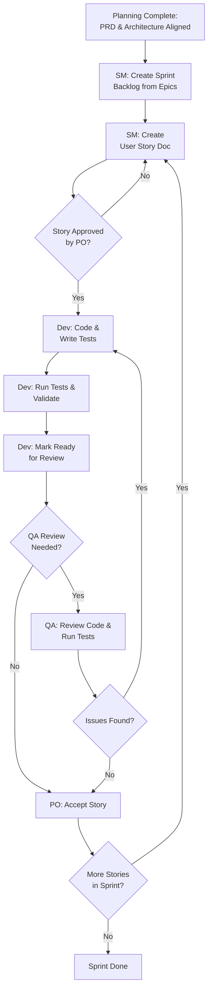

**Step-by-Step Guide:**

1. **Planning Readiness** – Before a sprint begins, the Product Owner ensures that all high-level documents are finalized. The PRD and Architecture are aligned and up to date (the PO has run the master checklist to verify alignment). This planning completeness (green light from PRD/Architecture) is the starting point for sprint planning.
2. **Sprint Backlog Creation (Scrum Master)** – The Scrum Master plans the sprint by breaking down the project’s epics into a sprint backlog of user stories. Using the aligned epics from the PRD, the SM identifies which stories or features to include in the sprint and creates the sprint backlog. For each new story, the SM invokes the user story template (via `/sm create-doc user-story`) to generate a story document that includes technical details from the architecture. This ensures each story is well-defined and ready for development.
3. **Story Approval (Product Owner)** – For each drafted user story, the Product Owner (or relevant stakeholders) reviews the content to ensure it meets the acceptance criteria and business requirements. The PO checks that the story’s description, tasks, and acceptance criteria align with the intent of the feature. If the story is unclear or incomplete, the SM updates or refines the story (possibly by iterating on the `/sm create-doc user-story` command) and the PO reviews again. Only once the **PO approves the story** does it move into development.
4. **Development (Developer)** – The Developer picks up the approved story and implements it task by task. The Dev agent writes code for each task and simultaneously writes tests (unit tests for each functionality) to adhere to BMAD’s test-driven workflow. As development progresses, the developer runs all tests and validation checks to ensure the code meets the story’s acceptance criteria and coding standards. The Dev agent will not mark a task complete unless all its tests pass and quality checks (like linting) succeed. Once all tasks in the story are done and validated, the Developer marks the story as **Ready for Review**.
5. **Quality Assurance (QA)** – If the story requires additional validation or if the Product Owner requests a deeper review, the QA agent steps in. The QA (acting as a senior engineer) reviews the implementation by running the project’s test suite and performing a code review. In BMAD, this is often triggered by the `/qa run review-story` command, which causes the QA agent to execute a thorough code review and run any extended tests. The QA validates that the code adheres to quality standards (architecture, coding standards, test coverage) and may refactor code or add tests to address any deficiencies. If the QA finds issues, the story is sent back to development for the Dev to fix the problems, after which it will be reviewed/tested again. Once QA is satisfied (or if QA was not needed for that story), the story is ready for final approval.
6. **Story Acceptance (Product Owner)** – The Product Owner performs the final verification of the story’s output. After development (and any QA review), the PO verifies that the acceptance criteria are fully met and the feature does what it’s supposed to do. If everything looks good and all criteria are satisfied, the PO accepts the story as “Done”. (If the feature isn’t satisfactory, the PO would provide feedback and the story would be reopened in development in the next iteration.)
7. **Sprint Completion** – The cycle of story creation, development, QA, and acceptance repeats for each story in the sprint backlog. The Scrum Master will continuously bring in the next story (returning to the “Create User Story” step for each new item), and the team iterates through steps 3–6 for each story. Once all planned stories in the sprint are completed and accepted by the PO, the **sprint is concluded**. The team can then hold a sprint review to demonstrate the completed features and a retrospective to improve the process for the next sprint.

---

**Sources:**

* BMAD-METHOD User Guide and Documentation. These documents provide detailed explanations of the BMAD framework’s agents, workflows (Greenfield vs. Brownfield), command syntax, and best practices.
* BMAD Agent Configuration and Workflow Specs, which illustrate the behavior of meta-agents (Orchestrator and Master) and the available commands for coordinating multi-agent interactions.
