Thanks for the clarification! I’ll examine the BMAD-METHOD GitHub repository to:

* Create Mermaid diagrams for a Greenfield and Brownfield project, showing standard agent lifecycle and how different agent capabilities (e.g., /dev, /qa) are involved at various stages.
* Include command patterns that agents can execute at each step.
* Build individual flowcharts for each agent under the `bmad-code` folder, focusing on user-agent interaction flows.

I’ll get started and update you once I have the results ready.

# BMAD Agent Workflow Diagrams

BMAD-METHOD (Breakthrough Method of Agile AI-Driven Development) introduces specialized AI agents that collaborate in an Agile workflow. Below are diagrams and explanations illustrating how to work with these agents for different project scenarios and roles. Each diagram is presented in Mermaid flowchart format with example commands, and all interactions between the user and agents are shown.

## Greenfield Project Workflow (New Project)

For a new **Greenfield** project, the BMAD agents follow a structured Agile process covering **analysis**, **requirements**, **design**, **development**, and **testing**. The flowchart below shows the main stages, the responsible agent at each stage, and example commands to invoke those agents:

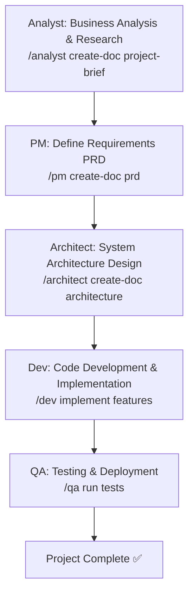

In this Greenfield workflow, the **Analyst** agent conducts market research and gathers requirements (often by creating a Project Brief). Next, the **Product Manager (PM)** agent produces a Product Requirements Document (PRD) defining features and priorities. The **Architect** agent then designs the system architecture. Once planning is done, the **Developer (Dev)** agent implements the features in code. Finally, the **QA Specialist** agent handles test planning and quality assurance, ensuring the developed product passes all tests before deployment. Each arrow above represents the transition to a new phase where the user invokes the next agent with a slash command (e.g. `/pm create-doc prd` to have the PM create a PRD).

*(Greenfield steps reference: 1. Business analysis, 2. Requirements definition, 3. Architecture design, 4. Development, 5. Testing.)*

## Brownfield Project Workflow (Existing Project)

For an existing **Brownfield** project (enhancing or adding features to an established system), the workflow is slightly adapted. It emphasizes understanding the current system and planning incremental changes. The flowchart below outlines a Brownfield process with example agent commands:

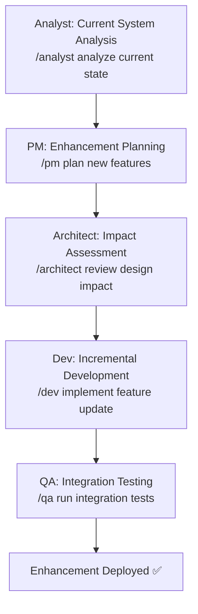

In this Brownfield scenario, the **Analyst** (or another suitable role) first examines the existing system and requirements (e.g. reviewing documentation or user feedback). Then the **PM** agent plans the enhancement – updating the PRD or writing a mini-requirements doc for the new feature. The **Architect** evaluates the impact of the changes on the current architecture (ensuring compatibility and noting any refactoring needs). Next, the **Dev** agent implements the new feature in an incremental, non-disruptive way. Finally, the **QA** agent performs integration testing to confirm the new feature works with the existing system without regressions. Just like in Greenfield, each stage is triggered by the user engaging the respective agent (for example, the user might type `/architect create-doc architecture` to update design documentation for the enhancement, or `/qa run tests` to execute the test suite). This ensures a smooth Agile cycle even in legacy projects.

*(Brownfield steps reference: 1. Current system analysis, 2. Enhancement planning, 3. Impact assessment, 4. Incremental dev, 5. Integration testing.)*

## Development & QA Lifecycle (Dev–QA Handoff)

A critical part of the Agile workflow is the iteration between development and testing. The diagram below captures a standard **Dev–QA lifecycle** during implementation, showing how the Developer and QA agents collaborate with the user to ensure quality:

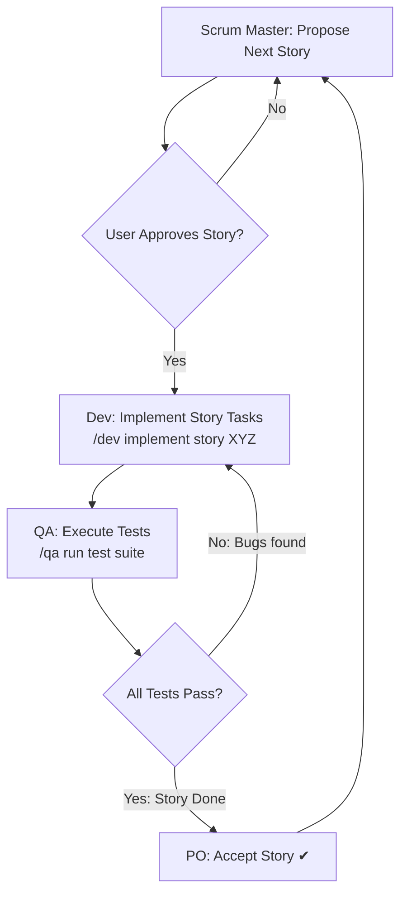

In this lifecycle, the **Scrum Master (SM)** agent (or the user) selects a user story for development from the backlog. The user (often playing the Product Owner role) reviews and approves the story before implementation. Once approved, the **Dev** agent writes code to implement the story's tasks (e.g. the user issues a command like `/dev implement story 1.2` to start development on story 1.2). When development is complete, the **QA** agent is invoked to run tests on the new code (such as executing unit tests, integration tests, etc.). If the QA tests uncover bugs or failed criteria, the workflow loops back – the Dev agent addresses the issues and the QA agent re-tests the fixes. Once all tests pass, the **Product Owner (PO)** (or user acting as PO) verifies the story against acceptance criteria and marks it as done. This iterative loop continues until the story is completed to satisfaction, ensuring high quality through Dev–QA collaboration.

*(The Dev–QA cycle aligns with BMAD’s Quality Assurance phase where QA does testing and the Dev fixes any bugs.)*

## Common Agent Command Patterns

BMAD agents use specific command structures with the `*` prefix for all commands. Each agent has a defined set of commands that correspond to their specialized tasks and capabilities. Below are the actual command patterns used in the BMAD framework:

### Core Command Structure

All BMAD agent commands use the **asterisk (`*`) prefix** when invoked:
- `*help` - Shows numbered list of available commands for the current agent
- `*chat-mode` - Enters conversational mode with advanced elicitation
- `*create-doc {template}` - Creates documents using agent-specific templates
- `*execute-checklist {checklist}` - Runs validation checklists
- `*exit` - Exits the current agent persona

### Agent-Specific Commands

**Architect Commands:**
- `*help`, `*chat-mode`, `*create-doc {template}`, `*execute-checklist {checklist}`, `*research {topic}`, `*exit`
- Templates: `architecture-tmpl`, `front-end-architecture-tmpl`, `fullstack-architecture-tmpl`, `brownfield-architecture-tmpl`

**Product Owner Commands:**
- `*help`, `*chat-mode`, `*create-doc {template}`, `*execute-checklist {checklist}`, `*shard-doc {document}`, `*correct-course`, `*create-epic`, `*create-story`, `*exit`
- Key checklist: `po-master-checklist` (adaptive for Greenfield/Brownfield projects)

**Scrum Master Commands:**
- `*help`, `*chat-mode`, `*create|draft`, `*pivot`, `*checklist {checklist}`, `*exit`
- Primary task: `create-next-story` (10-step comprehensive story creation process)

**Developer Commands:**
- `*help`, `*run-tests`, `*debug-log`, `*complete-story`, `*exit`
- Story-centric workflow with sequential task execution

**QA Commands:**
- `*help`, `*chat-mode`, `*exit`
- Primary task: `review-story` (active refactoring and senior code review)

### Meta-Agent Commands

**BMAD Orchestrator Commands:**
- `*help`, `*chat-mode`, `*kb-mode`, `*status`, `*agent`, `*exit`, `*task`, `*workflow`, `*workflow-guidance`, `*plan`, `*plan-status`, `*plan-update`, `*checklist`, `*yolo`, `*party-mode`, `*doc-out`

**BMAD Master Commands:**
- `*help`, `*chat`, `*status`, `*task`, `*list`, `*plan`, `*plan-status`, `*plan-update`, `*exit`, `*yolo`, `*doc-out`

### Template and Checklist Integration

Commands are tightly integrated with the BMAD framework's templates and checklists:
- **Templates**: 11 professional document templates (PRD, architecture variants, project brief, etc.)
- **Checklists**: 6 validation checklists including the comprehensive 380-point architect checklist
- **Tasks**: 17 specialized tasks including `create-next-story`, `review-story`, `execute-checklist`

### Command Resolution

Agents use flexible request resolution to match user intent to commands:
- "draft story" → `*create` → `create-next-story` task
- "make a new prd" → `*create-doc` + `prd-tmpl` template
- "run validation" → `*execute-checklist` + appropriate checklist

Each agent maintains numbered option lists when presenting choices, allowing users to type numbers for selection. The `*help` command always shows the complete, current command set for the active agent.

## Agent-Specific Interaction Flows

Next, we provide a flowchart for each BMAD agent, illustrating how a user would typically interact with that agent and what the agent produces. Each agent has a distinct role and **capabilities** in the Agile team, and the flows below show example interactions in context.

### Analyst (Business Analyst) Agent

The **Analyst** agent specializes in early-stage planning: market research, brainstorming, and requirements gathering. A common interaction with the Analyst is to create a **Project Brief** or conduct a feasibility analysis for a new idea.

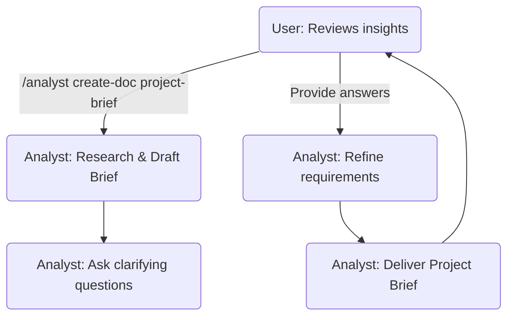

In this flow, the **User** invokes the Analyst (for example with `/analyst create-doc project-brief`) to perform market research and draft a project brief. The Analyst agent may ask follow-up questions to clarify project context or requirements, then iteratively refines the brief. Finally, the Analyst produces a document or summary of findings (market analysis, key requirements, etc.) and shares it with the user. The user can then review these insights to inform the next steps. This agent is best used at the **project initiation** stage for brainstorming and defining the problem space.

### Product Manager (PM) Agent

The **Product Manager** agent is responsible for defining the product vision, requirements, and priorities. A typical use case is generating a **Product Requirements Document (PRD)** and managing the feature roadmap.


Here the user triggers the PM agent to create a PRD (e.g. `/pm create-doc prd`). The PM agent gathers existing requirements (from the Analyst’s brief or user input) and drafts the PRD, possibly prompting the user for additional feature details or priorities. The agent then refines each section (such as objectives, user stories, acceptance criteria) through an interactive process. The result is a comprehensive PRD document which the PM agent delivers. The user reviews this PRD to ensure it meets the vision and can then proceed to architecture and development. The PM agent is typically used in **planning and definition** phases to solidify *what* needs to be built.

### Solution Architect Agent

The **Architect** agent (Winston) is a holistic system architect and full-stack technical leader responsible for comprehensive system design, technology selection, and architectural validation. The Architect uses a rigorous validation process with a 380-point checklist to ensure production-ready designs.

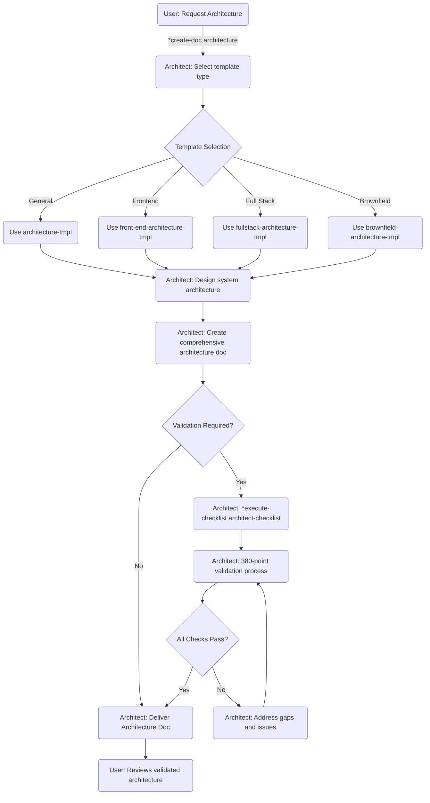

**Key Capabilities:**
- **Template Selection**: Chooses appropriate architecture template based on project type (general, frontend, fullstack, brownfield)
- **Comprehensive Design**: Creates system architecture covering all layers from frontend to infrastructure
- **380-Point Validation**: Runs comprehensive architect checklist covering:
  - Requirements alignment (functional/non-functional)
  - Architecture fundamentals (clarity, patterns, modularity)
  - Technology stack decisions with specific versions
  - Frontend design implementation (if applicable)
  - Resilience & operational readiness
  - Security & compliance at every layer
  - AI agent implementation suitability
  - Performance & scaling strategies
- **Deep Research**: Can generate research prompts for complex architectural decisions using `*research {topic}`
- **Cross-Stack Optimization**: Ensures holistic performance across all system layers

**Core Principles**: Holistic system thinking, user experience drives architecture, pragmatic technology selection, progressive complexity, security at every layer, cost-conscious engineering, and living architecture designed for change.

The Architect agent produces validated, production-ready architecture documents that serve as the foundation for all subsequent development phases. The comprehensive validation process ensures all technical decisions are sound before development begins.

### Developer (Dev) Agent

The **Developer** agent (James) is an expert senior software engineer and implementation specialist focused on story-centric development with sequential task execution. The Dev agent follows a strict test-driven workflow with comprehensive quality gates and maintains detailed execution records.

```mermaid
flowchart TD
    U(User: Assign story) -->|Story file provided| D1(Dev: Load story and always-files)
    D1 --> D2(Dev: Read task 1 requirements)
    D2 --> D3(Dev: Implement code for task)
    D3 --> D4(Dev: Write corresponding unit tests)
    D4 --> D5(Dev: Execute validations)
    D5 --> D6{All Validations Pass?}
    D6 -->|No| D7(Dev: Fix issues and retry)
    D7 --> D5
    D6 -->|Yes| D8(Dev: Mark task '[x]' complete)
    D8 --> D9(Dev: Update debug log if needed)
    D9 --> D10{More Tasks in Story?}
    D10 -->|Yes| D11(Dev: Read next task requirements)
    D11 --> D3
    D10 -->|No| D12(Dev: Run complete story validation)
    D12 --> D13(Dev: Update File List with all changes)
    D13 --> D14(Dev: Mark story 'Ready for Review')
    D14 --> U2(User: Story ready for QA)
```

**Story-Centric Development Workflow:**
- **Task Flow**: `Read task → Implement → Write tests → Execute validations → Mark [x] → Next task`
- **Sequential Execution**: Completes tasks one-by-one in order, never skipping ahead
- **Quality Gates**: NEVER completes tasks with failing automated validations
- **Test-Driven**: Every task includes unit test implementation as part of completion criteria

**Key Capabilities:**
- **Story Record Management**: ONLY updates Dev Agent Record sections in story files:
  - **Task Checkboxes**: `[ ]` not started → `[-]` in progress → `[x]` complete
  - **Debug Log**: Maintains table format `| Task | File | Change | Reverted? |`
  - **Completion Notes**: Records deviations from ACs or tasks (<50 words)
  - **Change Log**: Tracks requirement changes only
  - **File List**: CRITICAL - Complete list of ALL files created/modified
- **Debug Discipline**: Logs temporary changes to debug table, reverts after fixes
- **Blocking Conditions**: Halts for unapproved dependencies, ambiguous requirements, 3 failures, missing config, failing validations
- **Quality Validation**: Uses `*run-tests` to execute linting and tests, `*debug-log` to show debug entries
- **Story Completion**: Uses `*complete-story` to finalize and mark as "Ready for Review"

**Core Principles**: Story-centric (story has ALL info needed), sequential task execution, test-driven quality, never complete with failing validations, maintain minimal context overhead.

The Dev agent operates entirely within the story context - it never loads PRD, architecture, or other documents unless explicitly directed in the story's dev notes. This ensures focused, efficient implementation with complete traceability.

### QA Specialist (QA) Agent

The **QA** agent (Quinn) is a senior developer and test architect with the authority to actively refactor and improve code directly. Unlike traditional QA roles that only identify issues, the QA agent acts as a senior developer who reviews, improves, and mentors through direct code improvements.

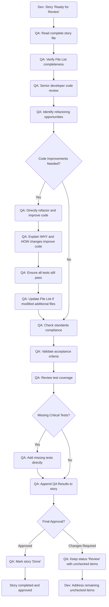

**Active Refactoring & Code Improvement Authority:**
- **Senior Developer Mindset**: Reviews and improves code as a senior mentoring juniors
- **Direct Code Changes**: Can and SHOULD refactor code where improvements are needed
- **Educational Approach**: Always explains WHY and HOW changes improve the code
- **Comprehensive Review**: Focuses on architecture, design patterns, performance, security, best practices

**Review-Story Process:**
1. **Complete Story Analysis**: Reads all acceptance criteria, dev notes, and completion notes
2. **File List Verification**: Ensures all files listed were actually created/modified
3. **Senior Code Review**: Reviews with architecture and design pattern expertise
4. **Active Refactoring**: Directly improves code and explains improvements
5. **Standards Compliance**: Validates coding standards, project structure, testing strategy
6. **Test Enhancement**: Adds missing critical tests and improves test coverage
7. **Final Approval**: Marks story 'Done' or provides specific improvement checklist

**QA Results Documentation**: Appends comprehensive results including:
- Code quality assessment with overall implementation evaluation
- Refactoring performed with detailed explanations (what, why, how)
- Compliance checklist (coding standards, project structure, testing strategy, ACs)
- Improvements checklist (checked = QA handled, unchecked = dev must address)
- Security and performance considerations
- Final status: ✓ Approved or ✗ Changes Required

**Core Principles**: Active refactoring, mentorship through action, risk-based testing, continuous improvement, balance perfection with pragmatism.

The QA agent has the authority and responsibility to improve code directly rather than just identifying issues, acting as a senior developer who enhances code quality while teaching through example.

### UX-Expert (UX Designer) Agent

The **UX-Expert** agent (User Experience Designer) helps design the user interface and user experience aspects of the project. The user engages this agent for UI/UX planning, wireframing (in text form), or usability advice.

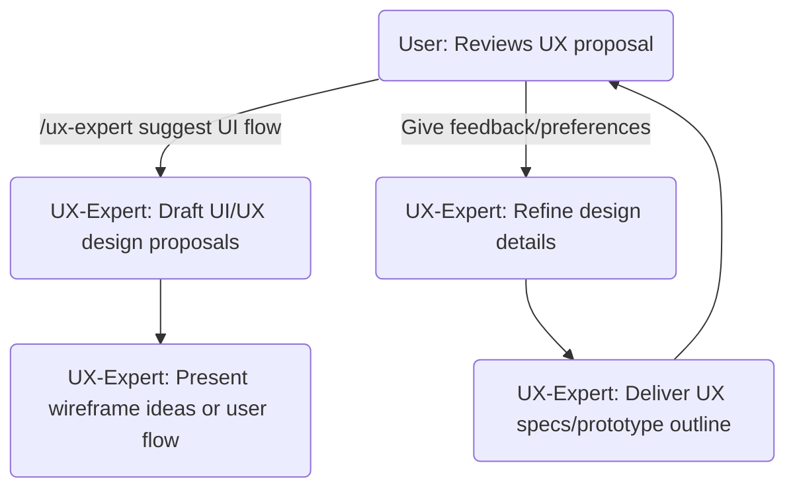

In this interaction, the user might ask the UX agent for a design on a feature (e.g., "/ux-expert create a wireframe for the signup page"). The UX-Expert agent responds by drafting a user flow or describing a wireframe/prototype for the interface. It could list UI components, layout ideas, or even produce a simple ASCII or Mermaid diagram for the UI if templates allow. The agent may ask the user for branding guidelines or user preferences to tailor the design. The user provides feedback (such as preferred color schemes or layouts), and the UX agent refines the design. Finally, the UX-Expert delivers a UX specification or prototype outline. The user reviews this to ensure it aligns with the product vision. This agent is utilized during the **design phase** in parallel with architecture, focusing on the *user interface and experience* aspect of the product.

### Product Owner (PO) Agent

The **Product Owner** agent (Sarah) is a technical product owner and process steward responsible for plan integrity validation, documentation quality, and ensuring actionable development tasks. The PO uses an adaptive master checklist that intelligently adjusts based on project type (Greenfield vs Brownfield) and UI/UX requirements.

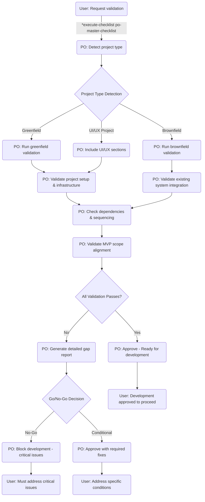

**Key Capabilities:**
- **Adaptive Validation**: Master checklist automatically adapts based on project type:
  - **Greenfield Projects**: Validates project scaffolding, initial setup, core dependencies
  - **Brownfield Projects**: Validates existing system integration, rollback procedures, user impact mitigation
  - **UI/UX Projects**: Includes design system setup, frontend infrastructure, user experience flows
- **10-Category Validation Process**:
  - Project Setup & Initialization
  - Infrastructure & Deployment sequencing  
  - External Dependencies & Integrations
  - UI/UX considerations (when applicable)
  - User/Agent responsibility allocation
  - Feature sequencing & dependencies
  - Risk management (brownfield-specific)
  - MVP scope alignment
  - Documentation & handoff requirements
  - Post-MVP considerations
- **Go/No-Go Authority**: Issues final approval decisions:
  - **APPROVED**: Plan ready for implementation
  - **CONDITIONAL**: Specific adjustments required
  - **REJECTED**: Critical deficiencies require major revision
- **Document Management**: Uses `*shard-doc` to break down complex documents and `*correct-course` for project realignment
- **Epic/Story Creation**: Can create brownfield epics and stories using `*create-epic` and `*create-story`

**Core Principles**: Guardian of quality & completeness, clarity & actionability for development, process adherence, dependency vigilance, autonomous preparation of work, and documentation ecosystem integrity.

The PO agent serves as the critical quality gate between planning and execution, ensuring all development work is properly prepared, sequenced, and aligned before teams begin implementation.

### Scrum Master (SM) Agent

The **Scrum Master** agent (Bob) is a technical scrum master and story preparation specialist responsible for creating crystal-clear, actionable stories for AI developers. The SM uses a comprehensive 10-step `create-next-story` process that integrates architecture shards to ensure stories contain all technical context needed for implementation.

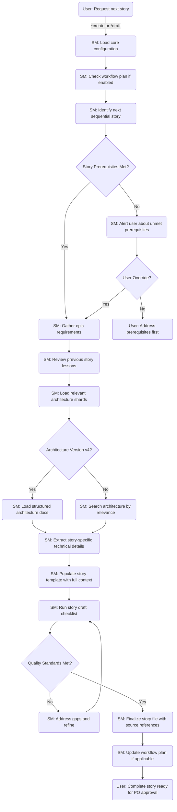

**10-Step Create-Next-Story Process:**
1. **Load Core Configuration**: Reads `.bmad-core/core-config.yaml` for project-specific settings
2. **Check Workflow Plan**: Validates sequence if workflow tracking is enabled
3. **Identify Next Story**: Determines sequential story based on completion status and epic structure
4. **Validate Prerequisites**: Ensures all dependencies are met before proceeding
5. **Gather Epic Requirements**: Extracts complete requirements from parent epic
6. **Review Previous Story**: Analyzes dev notes and lessons learned for continuity
7. **Load Architecture Context**: Systematically reads relevant architecture shards:
   - **All Stories**: tech-stack.md, unified-project-structure.md, coding-standards.md, testing-strategy.md
   - **Backend Stories**: data-models.md, database-schema.md, backend-architecture.md, rest-api-spec.md
   - **Frontend Stories**: frontend-architecture.md, components.md, core-workflows.md
8. **Extract Technical Details**: Gathers story-specific implementation guidance with source references
9. **Populate Story Template**: Creates comprehensive story file with full technical context
10. **Quality Validation**: Runs story draft checklist and updates workflow plan

**Key Capabilities:**
- **Sequential Story Management**: Ensures logical progression through epic structure
- **Architecture Integration**: Incorporates all relevant technical context from architecture shards
- **Source Referencing**: Every technical detail includes source documentation reference
- **Quality Assurance**: Built-in validation ensures stories meet developer readiness standards
- **Workflow Tracking**: Integrates with project workflow plans when enabled

**Core Principle**: Stories contain ALL information needed for implementation - developers never need to search other documents.

The SM agent produces self-contained, actionable stories that enable AI developers to implement features without additional research or context gathering.

## Expansion Pack Agents

BMAD extends beyond core software development with specialized expansion packs that add domain-specific agents and capabilities. These expansion packs demonstrate BMAD's extensibility and provide specialized workflows for different industries and use cases.

### Game Development Expansion Pack

**Game Designer Agent**: Specializes in game design documentation, level design, and game mechanics. Creates game design documents using `game-design-doc-tmpl` and `level-design-doc-tmpl` templates.

**Game Developer Agent**: Focused on game-specific development patterns and Phaser 2D game implementation. Uses specialized templates like `game-architecture-tmpl` and follows game development workflows.

**Game Scrum Master Agent**: Manages game development sprints with understanding of game-specific milestones, playtesting cycles, and iterative game design processes.

**Available Workflows**: 
- `game-dev-greenfield`: Complete game development from concept to release
- `game-prototype`: Rapid prototyping for game concept validation

### Creator Tools Expansion Pack

**BMAD The Creator Agent**: Framework extension specialist responsible for creating new agents, expansion packs, and extending the BMAD ecosystem. This meta-agent can generate new agent configurations, templates, and workflows.

**Key Capabilities**:
- `create-agent`: Generates new agent configurations with proper templates and tasks
- `generate-expansion-pack`: Creates complete expansion packs with multiple agents and workflows
- Uses `agent-tmpl` and `expansion-pack-plan-tmpl` for structured creation

### Infrastructure DevOps Expansion Pack

**Infrastructure DevOps Platform Agent**: DevOps specialist focused on infrastructure architecture, platform engineering, and deployment automation. Handles cloud infrastructure, CI/CD pipelines, and operational concerns.

**Key Capabilities**:
- `review-infrastructure`: Validates infrastructure configurations and best practices
- `validate-infrastructure`: Ensures infrastructure meets security and scalability requirements
- Uses `infrastructure-architecture-tmpl` and `infrastructure-platform-from-arch-tmpl`

### Expansion Pack Integration

Each expansion pack integrates seamlessly with the core BMAD framework:
- **Team Configurations**: Can be combined with core agents in custom team configurations
- **Workflow Integration**: Expansion pack workflows can reference and build upon core workflows
- **Template Inheritance**: Expansion packs can extend core templates while adding domain-specific sections
- **Command Consistency**: All expansion pack agents follow the same `*` command prefix structure

**Creating Custom Expansion Packs**: Use the BMAD The Creator agent to generate new expansion packs tailored to specific industries or use cases, maintaining the same quality and integration standards as core BMAD agents.

### BMad Orchestrator (Team Coordinator) Agent

The **BMAD Orchestrator** is a special meta-agent that coordinates all other agents and workflows. It can dynamically assume any role or guide the user through multi-agent processes. Think of it as the **team coordinator** that helps choose which agent or workflow is needed at a given time.

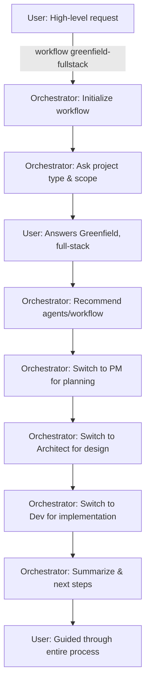

In this flow, the user issues a broad instruction to the orchestrator (for example, `*workflow greenfield-fullstack` in the IDE or a general request like "Start a new project" in chat). The Orchestrator agent responds by gathering basic info (project type, scope) and then sets up the workflow. It will **recommend the next steps or automatically switch to the relevant agent** for each stage. For instance, it may announce "Now switching to Product Manager for requirements" and effectively become the PM agent to create the PRD, then later become the Architect agent for design, and so on. The orchestrator handles these transformations internally, so the user doesn’t have to manually switch agents each time – it guides the user through an entire multi-agent workflow. Throughout, the orchestrator keeps track of the overall state and ensures each role is invoked in order. By the end, the user is taken through planning, design, development, etc., with the orchestrator summarizing progress and suggesting next steps. The Orchestrator is especially useful for **complex, multi-step tasks** or when you're not sure which agent to use; it will pick the right specialist (or instruct you how to proceed) at each juncture. It also supports commands like `*agent <name>` to directly switch to a specific agent, `*task <name>` to run predefined tasks, and `*help` to list available options.

### BMad Master (Universal Expert) Agent

The **BMAD Master** agent is another meta-agent that possesses **all capabilities in one**. Unlike the orchestrator, the Master agent doesn’t switch personas; it acts as a single universal expert that can handle any request across the entire development lifecycle.

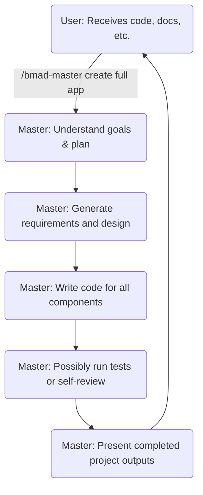

In this flow, the user gives a high-level instruction to the BMad Master agent (for example, asking it to create an entire application or solve an end-to-end problem). The Master agent parses the request and formulates a plan. It can produce its own requirements or break down tasks internally, then proceed to generate the necessary artifacts. For instance, it might draft a mini-PRD or outline, then directly start coding the solution (covering front-end, back-end, etc. as needed). It may even execute tests or review its output for consistency (since it has QA and dev knowledge combined). Finally, the BMad Master provides the user with all the outputs – code files, documentation, and any other relevant results – in one go or in an interactive manner. The user receives a comprehensive result without manually coordinating between agents. The Master agent is ideal for **one-shot or single-session tasks** where you want a single AI agent to handle everything together. It trades the fine-grained 
control of individual agents for convenience, as it encapsulates the entire Agile team’s knowledge in one persona.

Great — I’ll now create two additional Mermaid diagrams:

1. A feature delivery flowchart starting after PRD and architecture are completed, showing the sequential tasks handled by Architect → PO → SM → Dev → QA.
2. A sprint planning and execution flowchart showing the broader cycle of backlog grooming, planning, delivery, and review across those same agents.

I’ll also write out step-by-step instructions for each agent in both workflows using standard BMAD commands.

I’ll update the canvas with these new diagrams and instructions shortly.


## Feature Delivery Flowchart (Post-PRD and Architecture)

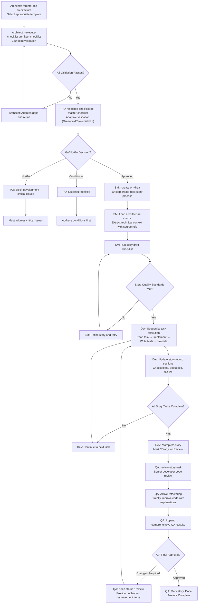

**Step-by-Step Guide:**

1. **Architect (Winston)** – Creates comprehensive system architecture using `*create-doc architecture` with appropriate template selection (general, frontend, fullstack, or brownfield). Follows with `*execute-checklist architect-checklist` running the 380-point validation covering requirements alignment, architecture fundamentals, technology stack decisions, security, and AI implementation suitability. Must address all gaps before proceeding.

2. **Product Owner (Sarah)** – Runs adaptive master validation using `*execute-checklist po-master-checklist` which automatically adjusts validation based on project type (Greenfield/Brownfield/UI). Validates 10 categories including project setup, dependencies, feature sequencing, MVP scope alignment, and risk management. Issues Go/No-Go decision: **APPROVED** (ready), **CONDITIONAL** (specific fixes required), or **REJECTED** (critical deficiencies). Development cannot proceed without approval.

3. **Scrum Master (Bob)** – Executes comprehensive `*create` or `*draft` command triggering the 10-step create-next-story process. Loads core configuration, identifies next sequential story, gathers epic requirements, reviews previous story lessons, systematically loads relevant architecture shards (tech-stack, coding-standards, testing-strategy, plus backend or frontend specific shards), extracts technical details with source references, populates story template with full context, and runs story draft checklist. Story contains ALL information needed - dev agents never need to search other documents.

4. **Developer (James)** – Implements story using strict sequential task execution workflow: `Read task → Implement → Write tests → Execute validations → Mark [x] → Next task`. Updates ONLY Dev Agent Record sections: task checkboxes, debug log table, completion notes, change log, and critical file list. Uses `*run-tests` for validations, `*debug-log` for tracking, never completes tasks with failing validations. Completes with `*complete-story` marking "Ready for Review".

5. **QA (Quinn)** – Performs active refactoring as senior developer using `review-story` task. Conducts comprehensive code review, directly refactors and improves code with explanations of WHY and HOW changes improve quality. Validates standards compliance, enhances test coverage, appends detailed QA Results with code quality assessment, refactoring performed, compliance checklist, and improvement items (checked = QA handled, unchecked = dev must address). Final authority to mark story "Done" or keep in "Review" status.
## Sprint Planning and Execution Flowchart

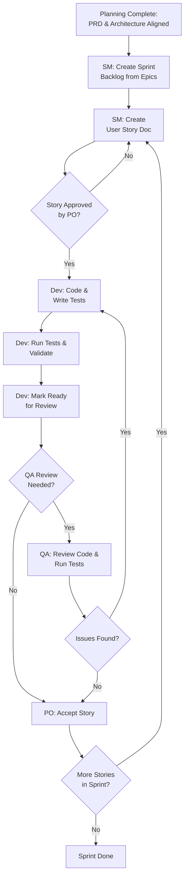

**Step-by-Step Guide:**

1. **Planning Readiness** – Before a sprint begins, the Product Owner ensures that all high-level documents are finalized. The PRD and Architecture are aligned and up to date (the PO has run the master checklist to verify alignment). This planning completeness (green light from PRD/Architecture) is the starting point for sprint planning.
2. **Sprint Backlog Creation (Scrum Master)** – The Scrum Master plans the sprint by breaking down the project’s epics into a sprint backlog of user stories. Using the aligned epics from the PRD, the SM identifies which stories or features to include in the sprint and creates the sprint backlog. For each new story, the SM invokes the user story template (via `/sm create-doc user-story`) to generate a story document that includes technical details from the architecture. This ensures each story is well-defined and ready for development.
3. **Story Approval (Product Owner)** – For each drafted user story, the Product Owner (or relevant stakeholders) reviews the content to ensure it meets the acceptance criteria and business requirements. The PO checks that the story’s description, tasks, and acceptance criteria align with the intent of the feature. If the story is unclear or incomplete, the SM updates or refines the story (possibly by iterating on the `/sm create-doc user-story` command) and the PO reviews again. Only once the **PO approves the story** does it move into development.
4. **Development (Developer)** – The Developer picks up the approved story and implements it task by task. The Dev agent writes code for each task and simultaneously writes tests (unit tests for each functionality) to adhere to BMAD’s test-driven workflow. As development progresses, the developer runs all tests and validation checks to ensure the code meets the story’s acceptance criteria and coding standards. The Dev agent will not mark a task complete unless all its tests pass and quality checks (like linting) succeed. Once all tasks in the story are done and validated, the Developer marks the story as **Ready for Review**.
5. **Quality Assurance (QA)** – If the story requires additional validation or if the Product Owner requests a deeper review, the QA agent steps in. The QA (acting as a senior engineer) reviews the implementation by running the project’s test suite and performing a code review. In BMAD, this is often triggered by the `/qa run review-story` command, which causes the QA agent to execute a thorough code review and run any extended tests. The QA validates that the code adheres to quality standards (architecture, coding standards, test coverage) and may refactor code or add tests to address any deficiencies. If the QA finds issues, the story is sent back to development for the Dev to fix the problems, after which it will be reviewed/tested again. Once QA is satisfied (or if QA was not needed for that story), the story is ready for final approval.
6. **Story Acceptance (Product Owner)** – The Product Owner performs the final verification of the story’s output. After development (and any QA review), the PO verifies that the acceptance criteria are fully met and the feature does what it’s supposed to do. If everything looks good and all criteria are satisfied, the PO accepts the story as “Done”. (If the feature isn’t satisfactory, the PO would provide feedback and the story would be reopened in development in the next iteration.)
7. **Sprint Completion** – The cycle of story creation, development, QA, and acceptance repeats for each story in the sprint backlog. The Scrum Master will continuously bring in the next story (returning to the “Create User Story” step for each new item), and the team iterates through steps 3–6 for each story. Once all planned stories in the sprint are completed and accepted by the PO, the **sprint is concluded**. The team can then hold a sprint review to demonstrate the completed features and a retrospective to improve the process for the next sprint.


---

**Sources:**

* BMAD-METHOD User Guide and Documentation. These documents provide detailed explanations of the BMAD framework’s agents, workflows (Greenfield vs. Brownfield), command syntax, and best practices.
* BMAD Agent Configuration and Workflow Specs, which illustrate the behavior of meta-agents (Orchestrator and Master) and the available commands for coordinating multi-agent interactions.
